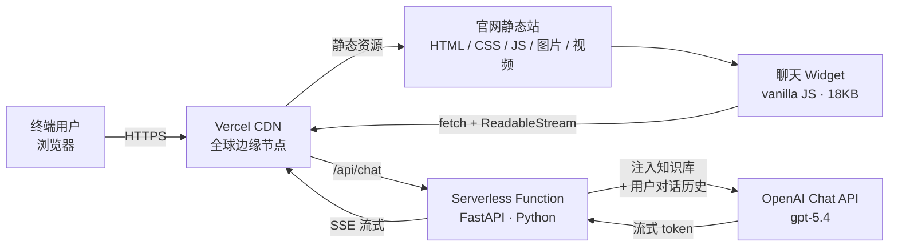
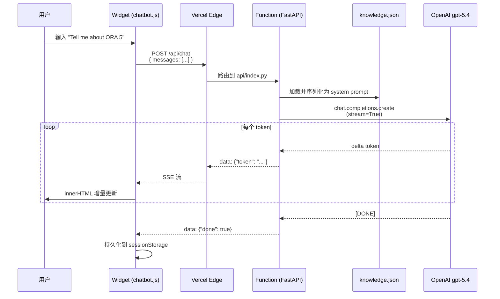

# 产品技术支撑说明

> GWM Europe 官网 AI 智能客服 · 技术架构与实现思路
> Version 1.0 · 适用对象：GWM 技术对接 / IT / 信息安全部门

---

## 1. 整体架构（一图看懂）

### 1.1 架构示意图



### 1.2 ASCII 兜底（PPT 用）

```
┌─────────────────────────────────────────────────────────────┐
│                    用户浏览器（PC / 移动端）                │
│                                                             │
│  ┌─────────────────────┐      ┌──────────────────────────┐  │
│  │  GWM 官网首页        │      │  聊天 Widget             │  │
│  │  (HTML/CSS/JS/图)   │ ◄──► │  - 浮动按钮              │  │
│  │                     │      │  - 流式渲染              │  │
│  └─────────────────────┘      └──────────┬───────────────┘  │
└──────────────────────────────────────────│──────────────────┘
                                           │ POST /api/chat
                                           │ (SSE 长连接)
                                           ▼
┌──────────────────────────────────────────────────────────────┐
│           Vercel 全球 CDN + Serverless Function              │
│                                                              │
│   ┌────────────────────┐     ┌─────────────────────────┐     │
│   │ 静态资源（public/）│     │ FastAPI Function        │     │
│   │ - 全站镜像         │     │ - /api/chat (SSE)       │     │
│   │ - 自动 CDN 缓存    │     │ - /api/health           │     │
│   └────────────────────┘     │ - 知识库 → System Prompt│     │
│                               └────────┬────────────────┘    │
└────────────────────────────────────────│─────────────────────┘
                                         │ HTTPS
                                         ▼
                              ┌─────────────────────────┐
                              │  OpenAI Chat Completions│
                              │  model: gpt-5.4         │
                              │  stream: true           │
                              └─────────────────────────┘
```

---

## 2. 核心组件

| 层级 | 组件 | 技术栈 | 体积 / 规模 | 作用 |
|---|---|---|---|---|
| **前端** | 官网静态站 | 原 GWM Adobe AEM 输出 | ~8.5 MB | 1:1 复刻 GWM 欧洲首页 |
| **前端** | 聊天 Widget | vanilla JS + CSS | ~18 KB | 浮动按钮 + 对话面板，CSS 命名空间隔离不污染主站 |
| **后端** | API 网关 | Vercel CDN + Edge | 全球节点 | TLS 终结、静态加速、函数路由 |
| **后端** | Chat 函数 | FastAPI 0.110 + AsyncOpenAI | ~40 MB（含依赖） | 注入 system prompt、调 LLM、SSE 流式回包 |
| **数据** | 知识库 | `chatbot/knowledge.json` | ~7 KB | 13 条 Q&A + 模型/品牌信息，注入到 system prompt |
| **模型** | LLM | OpenAI `gpt-5.4` | 第三方服务 | 自然语言理解 + 生成 |

---

## 3. 一次对话的端到端数据流



**关键时延（实测）：**

| 阶段 | 耗时 |
|---|---|
| Widget 渲染（首屏 + 18 KB JS 加载） | < 100 ms |
| `/api/chat` 函数冷启动 | 500–1500 ms（首次） |
| `/api/chat` 函数热路径 | 50–150 ms |
| OpenAI 首 token 时间（TTFT） | 400–800 ms |
| 一段 50 字回复 token-by-token 渲染 | 1–2 s |

---

## 4. 模型调用 & 知识库注入

### 4.1 System Prompt 拼装策略

每次调用 `gpt-5.4` 之前，后端把整个 `knowledge.json` 序列化后嵌入 system prompt：

```python
SYSTEM_PROMPT_TEMPLATE = """You are the GWM Europe assistant — a friendly,
concise demo chatbot embedded in the GWM Europe homepage.

Use the JSON knowledge base below as your source of truth for product names,
taglines, contact info and section URLs. If a question can't be answered
from the knowledge base, say so briefly and suggest emailing
info@gwm-eu.com or visiting the contact page.

Tone: warm, professional, brief (2-4 sentences unless asked for detail).
Use **bold** for product names. When relevant, include a markdown link.

KNOWLEDGE BASE:
{kb_json}
"""
```

### 4.2 知识库结构（节选）

```json
{
  "company": {
    "name": "GWM (Great Wall Motor)",
    "users_worldwide": "16,000,000+",
    "tagline": "Go With More",
    "contact_email": "info@gwm-eu.com"
  },
  "models": [
    { "name": "GWM ORA 5", "category": "Stylish Premium SUV", "url": "..." },
    { "name": "GWM H7",    "tagline":  "Driven By Bold Intelligence", "url": "..." },
    { "name": "GWM JOLION MAX", "category": "Versatile Urban SUV", "url": "..." }
  ],
  "qa": [ { "id": "ora5", "keywords": [...], "answer": "..." }, ... ],
  "fallback": "..."
}
```

### 4.3 为什么不用向量检索（RAG）？

当前知识库 ~7 KB，**全量塞进 system prompt 比向量检索更快、更准、零运维**。一旦内容超过 ~30 KB（约 5–6 千字）需要分页时，再切到 RAG（如 Pinecone / pgvector / Vercel KV）。当前阶段 RAG 是**过度工程**。

升级到 RAG 时改动局限于：① 向量化脚本、② `system_prompt()` 函数中的检索逻辑。Widget 与函数对外协议不变。

---

## 5. 部署形态

### 5.1 当前（POC / Demo 阶段）

```
GitHub Repo (private/public)
        │
        │ git push 触发 webhook
        ▼
Vercel Hobby Tier
  ├─ public/        → CDN 静态分发（含 8.5 MB 官网镜像）
  ├─ api/index.py   → Python Serverless Function（60s 超时）
  └─ Env Vars       → OPENAI_API_KEY, OPENAI_MODEL
        │
        │ HTTPS 调用
        ▼
OpenAI API（gpt-5.4）
```

**单点：Vercel + OpenAI**。无数据库、无缓存层、无消息队列——demo 阶段刻意保持极简。

### 5.2 生产形态（建议）

```
            ┌──────────────────────────────┐
            │  GWM CDN（自有/CloudFront）  │ ← 静态资源由原官网 CDN 出
            └──────────────┬───────────────┘
                           │ <script>/api/chat</script> 反向代理
                           ▼
            ┌──────────────────────────────┐
            │  Chat 后端（K8s/Lambda/ECS） │
            │  - 速率限制                   │
            │  - 滥用检测                   │
            │  - 日志聚合到 ELK/Datadog    │
            └──────────────┬───────────────┘
                           │
                ┌──────────┴──────────┐
                ▼                     ▼
    ┌──────────────────┐    ┌──────────────────┐
    │ OpenAI / Azure   │    │ Knowledge Store  │
    │  OpenAI / 其他    │    │ JSON / RAG / KV  │
    └──────────────────┘    └──────────────────┘
```

可选增强：
- **多模型路由**（cost/quality 分级）：简单问题打 `gpt-4o-mini`，复杂打 `gpt-4o` 或 `gpt-5`
- **缓存层**：高频 Q&A（如"如何成为经销商"）做 Redis 缓存，命中即返回，不打 LLM
- **观测**：Datadog APM 追踪 `/api/chat` 时延、token 用量、错误率

---

## 6. 安全与隐私

| 风险点 | 当前措施 | 生产建议 |
|---|---|---|
| API key 泄露 | 仅在服务端 `.env` / Vercel Env Vars，绝不进 git、绝不出现在前端 | 同当前；定期轮换；观察 OpenAI Usage 异常告警 |
| 用户输入被注入指令（prompt injection） | system prompt 限制角色为"GWM 客服"+ fallback 固定话术 | 加入 OpenAI Moderation API 预过滤；输入长度限制 1000 字符 |
| 滥用刷接口（薅 token） | 无（demo 不做） | Vercel 边缘速率限制（每 IP / 每分钟）+ Cloudflare Turnstile / hCaptcha |
| 用户聊天内容隐私 | 仅缓存在用户浏览器 `sessionStorage`，关闭即丢；服务端不落库 | 可选：聊天匿名归档到企业 BI（清洗 PII 后） |
| GDPR / Cookie | OneTrust 横幅原站已有，不影响 widget | 在 Cookie Policy 中追加"AI 助手"条款 |
| 跨域 | 当前同源（同 Vercel 域），无需 CORS | 若与官网异域部署则白名单 origin |

---

## 7. 可扩展性 / 后续路线

| 功能 | 改动量 | 说明 |
|---|:-:|---|
| 多语言（IT / ES / DE）| 小 | 知识库按语言分文件；system prompt 末尾加 `Respond in the user's language` |
| 模型切换（Claude / Gemini / Azure / 国内大模型）| 小 | 改 `.env` 的 `OPENAI_BASE_URL`；OpenAI SDK 与多家兼容 |
| 多渠道接入（WhatsApp / Messenger / Web）| 中 | 抽象出 `/api/chat` 协议层，渠道适配器各自封装 |
| 用户身份关联 / 个性化 | 中 | 接入 GWM CRM；system prompt 注入用户车型、保养记录 |
| 真正 RAG（车型手册 PDF / 维保手册）| 中 | 离线向量化 → Pinecone；运行时检索后注入 |
| 语音输入 / 输出 | 中 | Whisper（输入）+ TTS（输出）；Widget 加录音按钮 |
| 工单 / 转人工 | 大 | 集成 Zendesk / Salesforce；触发条件 + 历史交接 |

---

## 8. 性能与成本量级估算

**前提**：日均 10 万 PV、聊天发起率 5%（即 5,000 次对话 / 日），平均 4 轮往返、每轮 800 input tokens + 200 output tokens。

| 维度 | 量级 |
|---|---|
| OpenAI token 消耗 / 日 | 5000 × 4 × (800+200) ≈ **20M tokens / 日** |
| 成本（按 gpt-4o-mini $0.15/$0.60 per M）| input 20M × 0.8 × 0.15 + output 20M × 0.2 × 0.60 ≈ **$4.80 / 日** |
| 成本（按 gpt-4o $2.5/$10 per M）| ≈ **$80 / 日** |
| Vercel 函数调用 | 5000 × 4 ≈ 20k / 日 → Hobby 层 100k/月够；上量后切 Pro |
| Vercel 静态流量 | 8.5 MB × 100k PV ≈ 850 GB/日 → 接入官网原 CDN 即可，不走 Vercel |

→ **关键结论**：模型选型对成本影响最大；建议默认 `gpt-4o-mini`，复杂场景才升级。

---

## 9. 技术选型理由

| 选择 | 备选 | 选它的原因 |
|---|---|---|
| **FastAPI** | Express / Flask / Hono | Python 生态对接 LLM 最成熟；ASGI 原生流式；与 Vercel Python Runtime 兼容 |
| **vanilla JS Widget** | React / Vue 组件 | 免构建、免依赖、18 KB 比任何框架都小；嵌入第三方站不引入 React 版本冲突 |
| **SSE（Server-Sent Events）** | WebSocket / 长轮询 | OpenAI / Anthropic / Gemini 都原生支持；浏览器零依赖；走 HTTP/1.1 兼容老代理 |
| **Vercel** | AWS Lambda / Render / 自建 | 5 分钟部署；全球 CDN 自带；免费层够 demo；可平滑迁移 |
| **OpenAI gpt-5.4** | Claude / Gemini / 国内 | 项目已选定；如果切换只需改一个环境变量 + 一行 SDK 名 |
| **Knowledge JSON 直注 prompt** | 向量检索 RAG | 内容只有 7 KB；prompt token 成本低于向量检索的额外延迟 + 运维 |

---

## 10. 文件 / 代码地图（开发协作用）

```
仓库根                  作用
├── public/             静态官网镜像（Vercel 在 / 路径分发）
├── api/index.py        Vercel 函数入口（导入 server.main:app）
├── server/main.py      FastAPI 业务核心：/api/chat、/api/health
├── chatbot/
│   ├── chatbot.css     Widget 样式（命名空间 .gwm-chatbot）
│   ├── chatbot.js      Widget 逻辑（SSE 解析、消息渲染、Markdown）
│   └── knowledge.json  知识库（每次 system prompt 注入源）
├── scripts/scrape.py   一次性官网爬取与本地化
├── vercel.json         Vercel 路由（/api/* → 函数；/* → public/）
└── requirements.txt    Vercel 函数依赖
```
