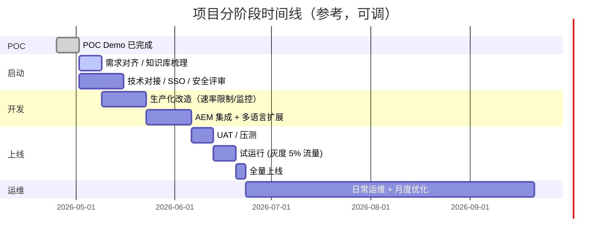

# 甲方 / 乙方 协同工作说明

> GWM Europe 官网 AI 智能客服 · 项目分工与运维交接
> Version 1.0 · 适用对象：项目经理 / 产品 / IT 接口人

---

## 0. 角色定义

| 角色 | 指代 |
|---|---|
| **甲方（Client）** | GWM Europe / 长城汽车欧洲区 |
| **乙方（Vendor）** | 我方（产品 + 工程团队） |

> **配套文档**：
> - [`architecture.md`](./architecture.md) — 技术架构与实现思路
> - [`admin-operations.md`](./admin-operations.md) — 后台运营功能与日常操作（业务团队必读）

---

## 1. 项目阶段总览



ASCII 兜底（PPT 用）：

```
[POC Demo] ─► [需求对齐] ─► [生产化开发] ─► [UAT] ─► [灰度] ─► [全量] ─► [运维]
   ✓ 已完成     2 周          4 周          1 周    1 周     1 周    持续
```

---

## 2. 工作分工 RACI 表

> R = 负责执行  A = 最终决策  C = 提供输入/咨询  I = 知会

| 工作项 | 甲方 GWM | 乙方 |
|---|:-:|:-:|
| **需求与内容** | | |
| 业务场景定义（要回答哪些问题、不该回答什么） | A · R | C |
| 知识库内容梳理（车型规格、保修条款、经销商联系） | A · R | C · 协助结构化 |
| 多语言文案审核（IT / ES / DE） | A · R | I |
| 品牌话术 / Tone of voice 把关 | A · R | C |
| 法务 / 隐私文案（Cookie 条款、AI 助手声明） | A · R | C |
| **设计与产品** | | |
| Widget 视觉风格（颜色、Logo、emoji） | C | A · R |
| 交互流程（快捷问题、转人工、表单收集） | A | R · C |
| 移动端适配 | I | A · R |
| **技术开发** | | |
| 前端 Widget 实现 | I | A · R |
| 后端 Chat API | I | A · R |
| 知识库注入逻辑 / system prompt | C | A · R |
| 速率限制 / 滥用防护 | C | A · R |
| 与 GWM AEM 集成（替换 demo 镜像，嵌入真实站） | C · 提供权限 | A · R |
| **基础设施** | | |
| OpenAI / Azure OpenAI 账号 | A · R · 出账 | C · 提供推荐配置 |
| API key 管理与轮换 | A · R | C |
| 域名 / SSL（如 chat.gwm-eu.com） | A · R | C |
| 部署平台账号（Vercel / 自建 K8s） | A · 决策 / 出账 | R · 部署运维 |
| GitHub / Git 仓库 | C · 决策（fork 到 GWM org / 保留乙方） | A · R |
| **测试与上线** | | |
| 功能测试用例 | C | A · R |
| 安全渗透测试 | A · 通常委托第三方 | C · 配合 |
| 性能 / 压测 | I | A · R |
| UAT 验收 | A · R | C · 修复 |
| 灰度 → 全量切换决策 | A · R | C |
| **运营运维** | | |
| 日常监控（错误率、token 用量、SLA） | I · 看月报 | A · R |
| OpenAI 账单审计 | A · R | C · 提供用量分析 |
| 知识库内容更新（新车型、新政策） | A · R | C · 提供更新流程 |
| Bug 修复 / 安全补丁 | I | A · R · 按 SLA |
| 模型升级（gpt-5.4 → 下一代） | C · 决策 | A · R |
| 月度 / 季度优化建议（话术 / 知识库 / 流量分析） | C | A · R · 提交报告 |

---

## 3. 平台与账号清单

```mermaid
flowchart TB
    subgraph 甲方["甲方 GWM 拥有 / 出账"]
        AEM[Adobe AEM<br/>官网 CMS]
        OpenAI[OpenAI 企业账号<br/>API key + 账单]
        DNS[域名 / DNS<br/>gwm-eu.com]
        SSO[企业 SSO / IT 安全]
    end

    subgraph 乙方["乙方运维 / 提供"]
        GH[GitHub 仓库<br/>代码 + Issue + PR]
        Vercel[Vercel 项目<br/>(或自建 K8s)]
        Mon[Datadog / Sentry<br/>监控告警]
        Doc[文档站 / Notion<br/>交付物]
    end

    subgraph 共享["双方共享访问"]
        Slack[Slack 频道 / 邮件组]
        Jira[Jira / Linear<br/>需求 + 缺陷追踪]
    end

    AEM ---|嵌入 widget script tag| Vercel
    OpenAI ---|API key 配 env var| Vercel
    DNS ---|CNAME 指向| Vercel
    GH ---|push 触发部署| Vercel
    Vercel ---|metric / log| Mon
```

详细清单：

| 平台 / 账号 | 拥有方 | 运维方 | 用途 | 谁能访问 |
|---|---|---|---|---|
| **OpenAI / Azure OpenAI** | 甲方 | 甲方 | API key、账单、用量看板 | 甲方 IT + 乙方（只读账单监控） |
| **域名 / DNS** | 甲方 | 甲方 | `chat.gwm-eu.com` 等 | 甲方 IT |
| **Adobe AEM** | 甲方 | 甲方 | 官网 CMS；嵌入 widget `<script>` | 甲方内容 + 乙方对接人 |
| **GitHub 仓库** | 甲方 fork（建议） | 乙方主开发 | 代码、PR review、issue | 双方开发人员 |
| **Vercel / 自建** | 看部署方案 | 乙方 | 部署、env vars、日志 | 乙方 + 甲方决策人 |
| **监控（Datadog / Sentry）** | 乙方提供，甲方可读 | 乙方 | 错误告警、性能指标 | 乙方主，甲方只读看板 |
| **沟通（Slack / 邮件 / 钉钉）** | 共建频道 | — | 日常对接、紧急工单 | 双方接口人 |
| **缺陷追踪（Jira / Linear）** | 乙方 | 乙方 | 需求、Bug、Sprint | 双方接口人 |

---

## 4. 协同工作流程

### 4.1 内容更新流程（甲方主导）

```
┌─────────────┐     ┌──────────────┐     ┌──────────────┐     ┌─────────┐
│ 甲方业务    │ ──► │ 提交内容工单 │ ──► │ 乙方更新     │ ──► │ 自动    │
│ 同事        │     │ (Jira/邮件)  │     │ knowledge.json│     │ 部署上线│
└─────────────┘     └──────────────┘     └──────────────┘     └─────────┘
   "新增 H7 版本                            git commit
    售价信息"                               git push
                                          
SLA: 2 个工作日内上线 (内容更新)
```

### 4.2 Bug / 故障流程（乙方主导）

```
监控告警 / 用户反馈
       │
       ▼
┌────────────────────┐
│ 乙方 on-call 接收 │
│ 创建 Incident      │
└─────────┬──────────┘
          │
   ┌──────┴──────┐
   │ 严重程度?   │
   └──┬─────┬────┘
      │     │
      P0   P1/P2
      │     │
      ▼     ▼
  立即      按节奏修复
  修复       (24h / 7d)
  +
  Slack
  通知甲方

SLA: P0 (服务中断) 1 小时响应；P1 (功能受影响) 24 小时；P2 (体验问题) 7 天
```

### 4.3 模型 / 大版本升级（双方共审）

```
乙方提案 → 甲方审 → POC 灰度 → 上线
   ↓         ↓         ↓
"建议从    "成本/    "5% 流量
 gpt-5.4    隐私/    跑 1 周对比"
 切 gpt-X"  合规
            考量"
```

---

## 5. 上线后的日常运维节奏

| 频次 | 内容 | 主导方 |
|---|---|---|
| **实时** | 错误告警（P0 服务中断、key 异常用量） | 乙方 on-call → 5 分钟内响应 |
| **每日** | 后台扫一眼 token 用量 / 错误率 | 乙方 |
| **每周** | 5 条样例对话抽查（话术 / 准确度 / 滥用样本） | 乙方报告，甲方审阅 |
| **每月** | 用量、成本、Top 问题、改进建议 | 乙方报告 → 双方例会 |
| **季度** | 知识库刷新（新车型、新政策、新经销商） | 甲方主导，乙方实施 |
| **年度** | 安全渗透测试、模型选型回顾、roadmap | 甲方决策，乙方提供方案 |

---

## 6. 交接物清单（项目结束 / 合同完结时）

乙方需移交甲方：

- [ ] 全部源代码 + git 完整历史
- [ ] 部署运行文档（README + architecture.md）
- [ ] 知识库结构说明 + 内容更新教程（截图 + 视频）
- [ ] 监控仪表板访问权 + 告警通讯录
- [ ] 已知 Bug / 技术债务清单
- [ ] 一次面对面培训（甲方 IT + 内容运营 各 2 小时）
- [ ] 90 天保修期内的 hotfix 承诺

---

## 7. 沟通机制

| 形式 | 频次 | 参与方 |
|---|---|---|
| **每日 standup** | 工作日 15 分钟 | 双方接口人（项目高峰期） |
| **每周对齐会** | 周三 1 小时 | PM + 技术 lead |
| **月度 review** | 每月最后周五 | 双方 PM + 业务负责人 |
| **季度 roadmap** | 每季度首月 | 双方决策层 |
| **紧急沟通** | 实时 | Slack 共享频道 / 紧急电话 |

---

## 8. 一页纸总结（给非技术决策者）

```
谁在做什么？
─────────────────────────────────────────────────────
甲方 GWM                       乙方
- 决定要回答什么问题           - 把它做成实际跑得起来的产品
- 提供品牌内容、车型信息       - 写代码、部署、监控、改 bug
- 出 OpenAI / 域名 / AEM       - 提建议、写文档、做培训
- 验收上线、决定预算

在哪里工作？
─────────────────────────────────────────────────────
代码        → GitHub（共享）
部署        → Vercel 或自建（乙方运维）
官网集成    → Adobe AEM（甲方掌控）
LLM 服务    → OpenAI（甲方账户）
日常沟通    → Slack + 邮件 + Jira

合同完结后甲方拿到什么？
─────────────────────────────────────────────────────
✓ 全部源代码与文档（甲方完全所有）
✓ 培训 + 90 天保修
✓ 后续可自行运维 / 找其他供应商接手
```
